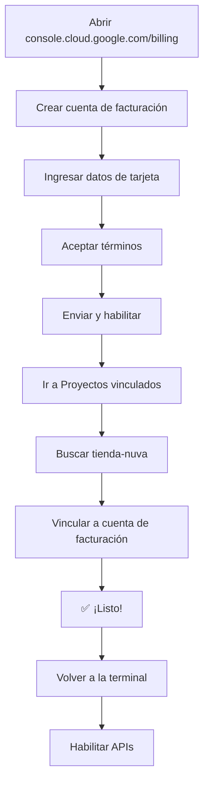

# 💳 Guía Rápida: Configurar Facturación en GCP

## ⚠️ Importante: Este Paso es OBLIGATORIO

Sin configurar la facturación, **NO podrás usar Cloud Run ni ningún servicio de GCP**.

**Pero tranquilo**: No te cobrarán nada si eres nuevo usuario.

---

## 🎁 Beneficios de Configurar Facturación

- ✅ **$300 USD de crédito gratis** por 90 días (nuevos usuarios)
- ✅ **Nivel gratuito permanente** de Cloud Run (2M solicitudes/mes)
- ✅ **No te cobran hasta que uses los $300** o pasen 90 días
- ✅ **GCP te avisa antes de cobrarte** cualquier cosa

---

## 📝 Pasos Exactos (5 minutos)

### Paso 1: Abrir la Consola de Facturación

1. **Abre tu navegador** (ya lo tienes abierto)
2. **Ve a esta URL**: https://console.cloud.google.com/billing
3. **Inicia sesión** con: `dagnerdev@gmail.com` (si no lo estás)

### Paso 2: Crear Cuenta de Facturación (Si es tu Primera Vez)

Verás una pantalla que dice algo como:

```
"Habilitar facturación para usar los servicios de Google Cloud"
```

1. Haz clic en el botón azul: **"CREAR CUENTA DE FACTURACIÓN"** o **"CREATE BILLING ACCOUNT"**

2. **Completa el formulario**:
   
   **Información de la cuenta**:
   - Nombre de la cuenta: `Mi Cuenta GCP` (o el que prefieras)
   - País: `Argentina` (o tu país)
   - Moneda: `USD - Dólar estadounidense`

   **Información de pago**:
   - Tipo de tarjeta: Crédito o Débito
   - Número de tarjeta: (tu tarjeta)
   - Fecha de vencimiento
   - CVV
   - Nombre en la tarjeta
   - Dirección de facturación

3. **Acepta los términos y condiciones**

4. Haz clic en: **"ENVIAR Y HABILITAR FACTURACIÓN"** o **"SUBMIT AND ENABLE BILLING"**

### Paso 3: Vincular el Proyecto a la Cuenta de Facturación

Después de crear la cuenta de facturación:

1. **Ve a**: https://console.cloud.google.com/billing/linkedaccount

2. Verás una lista de proyectos. Busca: **`tienda-nuva`**

3. Si no está vinculado, verás un mensaje que dice "Sin cuenta de facturación"

4. Haz clic en los **3 puntos verticales** (⋮) al lado de `tienda-nuva`

5. Selecciona: **"Cambiar cuenta de facturación"** o **"Change billing account"**

6. Selecciona la cuenta de facturación que acabas de crear

7. Haz clic en: **"ESTABLECER CUENTA"** o **"SET ACCOUNT"**

### Paso 4: Verificar que Está Configurado

1. Refresca la página
2. Deberías ver que `tienda-nuva` ahora tiene una cuenta de facturación vinculada
3. Verás algo como: "Cuenta de facturación: Mi Cuenta GCP"

---

## ✅ Verificación desde la Terminal

Una vez hecho lo anterior, ejecuta en tu terminal:

```bash
# Verificar que el proyecto existe
gcloud projects describe tienda-nuva

# Deberías ver información del proyecto sin errores
```

Luego intenta habilitar las APIs:

```bash
# Habilitar Cloud Run
gcloud services enable run.googleapis.com

# Si este comando funciona SIN errores, ¡la facturación está configurada! 🎉
```

---

## 🔄 Flujo Completo



---

## 🚨 Problemas Comunes

### "No tengo tarjeta de crédito"

**Solución**: Puedes usar una tarjeta de débito. GCP acepta:
- Visa
- Mastercard
- American Express

### "Me da miedo que me cobren"

**Tranquilo**:
- GCP NO te cobra automáticamente después del período gratuito
- Te envía emails de advertencia cuando te acercas al límite
- Puedes configurar alertas de presupuesto
- Puedes cancelar en cualquier momento

### "La página está en inglés"

**Solución**: 
1. Busca el ícono de configuración (⚙️) arriba a la derecha
2. Selecciona "Language" o "Idioma"
3. Cambia a "Español"

---

## 💰 Configurar Alertas de Presupuesto (Opcional pero Recomendado)

Para estar tranquilo, configura alertas:

1. Ve a: https://console.cloud.google.com/billing/budgets
2. Haz clic en: **"CREAR PRESUPUESTO"**
3. Configura:
   - Nombre: `Alerta Mensual`
   - Proyectos: `tienda-nuva`
   - Presupuesto: `$10 USD` (o lo que prefieras)
   - Alertas: `50%, 90%, 100%`
4. Ingresa tu email para recibir notificaciones
5. Haz clic en: **"FINALIZAR"**

Ahora recibirás un email si gastas más de $5, $9 o $10 USD.

---

## 📞 Después de Configurar

**Avísame cuando hayas terminado** y te ayudo con los siguientes pasos:

1. ✅ Habilitar las APIs necesarias
2. ✅ Configurar permisos de Cloud Build
3. ✅ Conectar GitHub
4. ✅ Hacer el primer despliegue

---

## 🎯 Resumen Ultra Rápido

1. **Abre**: https://console.cloud.google.com/billing
2. **Crea** cuenta de facturación (con tu tarjeta)
3. **Vincula** el proyecto `tienda-nuva`
4. **Verifica** ejecutando: `gcloud services enable run.googleapis.com`
5. **Avísame** cuando esté listo

---

**Tiempo estimado**: 5-10 minutos

**¿Necesitas ayuda con algún paso específico?** Dime en qué parte estás y te guío.
