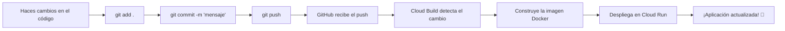

# 🚀 Configuración de Despliegue Automático con GitHub y GCP

Esta guía te mostrará cómo configurar tu proyecto para que **cada vez que hagas `git push`, tu aplicación se despliegue automáticamente** en Google Cloud Platform.

---

## 📋 Información de tu Repositorio

- **Repositorio**: `https://github.com/Kevin-Ari/nv-repo.git`
- **Usuario**: `Kevin-Ari`
- **Rama**: `main`

---

## 🎯 Flujo de Trabajo que Vamos a Configurar



---

## 📝 Paso a Paso: Configuración Inicial

### Paso 1: Instalar y Configurar Google Cloud CLI

Si aún no lo has hecho:

```bash
# Descargar desde: https://cloud.google.com/sdk/docs/install
# Después de instalar, ejecuta:

gcloud init
```

Sigue las instrucciones para:
1. Iniciar sesión con tu cuenta de Google
2. Seleccionar o crear un proyecto (ej: `tienda-carrito`)
3. Seleccionar región (recomendado: `us-central1`)

### Paso 2: Habilitar APIs Necesarias

```bash
# Habilitar Cloud Run
gcloud services enable run.googleapis.com

# Habilitar Container Registry
gcloud services enable containerregistry.googleapis.com

# Habilitar Cloud Build (para CI/CD)
gcloud services enable cloudbuild.googleapis.com

# Habilitar Secret Manager (para credenciales)
gcloud services enable secretmanager.googleapis.com
```

### Paso 3: Configurar Permisos de Cloud Build

Cloud Build necesita permisos para desplegar en Cloud Run:

```bash
# Obtener el número de tu proyecto
PROJECT_ID=$(gcloud config get-value project)
PROJECT_NUMBER=$(gcloud projects describe $PROJECT_ID --format="value(projectNumber)")

# Dar permisos a Cloud Build
gcloud projects add-iam-policy-binding $PROJECT_ID \
    --member="serviceAccount:${PROJECT_NUMBER}@cloudbuild.gserviceaccount.com" \
    --role="roles/run.admin"

gcloud projects add-iam-policy-binding $PROJECT_ID \
    --member="serviceAccount:${PROJECT_NUMBER}@cloudbuild.gserviceaccount.com" \
    --role="roles/iam.serviceAccountUser"
```

---

## 🔗 Conectar GitHub con Google Cloud Build

### Opción A: Desde la Consola Web (Más Fácil)

1. **Ve a Cloud Build en la consola de GCP**:
   - URL: https://console.cloud.google.com/cloud-build/triggers
   - O busca "Cloud Build" en el buscador de GCP

2. **Conecta tu repositorio**:
   - Haz clic en **"CONNECT REPOSITORY"** o **"CONECTAR REPOSITORIO"**
   - Selecciona **"GitHub"**
   - Haz clic en **"Authenticate"** o **"Autenticar"**
   - Se abrirá una ventana de GitHub para autorizar
   - Inicia sesión en GitHub si es necesario
   - Autoriza a Google Cloud Build

3. **Selecciona tu repositorio**:
   - Busca y selecciona: `Kevin-Ari/nv-repo`
   - Haz clic en **"Connect"** o **"Conectar"**

4. **Crear el Trigger**:
   - Haz clic en **"CREATE TRIGGER"** o **"CREAR ACTIVADOR"**
   - Configura así:
     - **Name**: `deploy-tienda-carrito`
     - **Event**: `Push to a branch`
     - **Source**: 
       - Repository: `Kevin-Ari/nv-repo`
       - Branch: `^main$`
     - **Configuration**: 
       - Type: `Cloud Build configuration file`
       - Location: `/cloudbuild.yaml`
   - Haz clic en **"CREATE"** o **"CREAR"**

### Opción B: Desde la Línea de Comandos

```bash
# Primero, conecta tu repositorio manualmente desde la consola web
# (solo la primera vez, siguiendo los pasos 1-3 de la Opción A)

# Luego crea el trigger con este comando:
gcloud builds triggers create github \
  --name="deploy-tienda-carrito" \
  --repo-name="nv-repo" \
  --repo-owner="Kevin-Ari" \
  --branch-pattern="^main$" \
  --build-config="cloudbuild.yaml"
```

---

## 📄 Verificar el Archivo cloudbuild.yaml

Ya tienes el archivo `cloudbuild.yaml` creado. Vamos a verificar que esté correcto:

```yaml
# Cloud Build configuration for automated deployment
steps:
  # Build the container image
  - name: 'gcr.io/cloud-builders/docker'
    args: ['build', '-t', 'gcr.io/$PROJECT_ID/tienda-carrito:$COMMIT_SHA', '.']
  
  # Push the container image to Container Registry
  - name: 'gcr.io/cloud-builders/docker'
    args: ['push', 'gcr.io/$PROJECT_ID/tienda-carrito:$COMMIT_SHA']
  
  # Deploy container image to Cloud Run
  - name: 'gcr.io/google.com/cloudsdktool/cloud-sdk'
    entrypoint: gcloud
    args:
      - 'run'
      - 'deploy'
      - 'tienda-carrito'
      - '--image'
      - 'gcr.io/$PROJECT_ID/tienda-carrito:$COMMIT_SHA'
      - '--region'
      - 'us-central1'
      - '--platform'
      - 'managed'
      - '--allow-unauthenticated'

images:
  - 'gcr.io/$PROJECT_ID/tienda-carrito:$COMMIT_SHA'
```

> [!NOTE]
> Este archivo ya está en tu proyecto. No necesitas modificarlo.

---

## 🚀 Primer Despliegue

Antes de que el despliegue automático funcione, necesitas hacer el **primer despliegue manual**:

### Paso 1: Subir los Archivos Nuevos a GitHub

```bash
# Navega a tu proyecto
cd c:\Users\kevin\OneDrive\Escritorio\Tienda-Carrito

# Agregar los archivos nuevos
git add Dockerfile .dockerignore .gcloudignore cloudbuild.yaml DESPLIEGUE_GCP.md

# Agregar otros cambios
git add backend/products.py frontend/app.js requirements.txt

# Hacer commit
git commit -m "Configuración para despliegue automático en GCP"

# Subir a GitHub
git push origin main
```

### Paso 2: Primer Despliegue Manual

```bash
# Desplegar por primera vez
gcloud run deploy tienda-carrito \
  --source . \
  --platform managed \
  --region us-central1 \
  --allow-unauthenticated
```

Este comando:
- ✅ Crea el servicio en Cloud Run
- ✅ Construye y despliega tu aplicación
- ✅ Te da una URL pública

**Tiempo estimado**: 2-5 minutos

---

## ✅ Probar el Despliegue Automático

Una vez configurado todo, cada vez que hagas cambios:

```bash
# 1. Haz cambios en tu código
# (edita archivos, agrega funcionalidades, etc.)

# 2. Agrega los cambios
git add .

# 3. Haz commit
git commit -m "Descripción de los cambios"

# 4. Sube a GitHub
git push origin main

# 5. ¡Cloud Build desplegará automáticamente! 🎉
```

### Ver el Progreso del Despliegue

Puedes ver el progreso en tiempo real:

**Opción 1: Consola Web**
- Ve a: https://console.cloud.google.com/cloud-build/builds
- Verás el build en progreso

**Opción 2: Línea de Comandos**
```bash
# Ver los últimos builds
gcloud builds list --limit=5

# Ver logs de un build específico
gcloud builds log [BUILD_ID]
```

---

## 📊 Tiempo de Despliegue

Después de hacer `git push`:

1. **GitHub recibe el push**: Instantáneo
2. **Cloud Build inicia**: 5-10 segundos
3. **Construye la imagen Docker**: 1-3 minutos
4. **Despliega en Cloud Run**: 30-60 segundos

**Total**: ~2-5 minutos desde `git push` hasta que tu app está actualizada

---

## 🔍 Monitoreo

### Ver Logs de Cloud Build

```bash
# Ver builds recientes
gcloud builds list --limit=10

# Ver logs de un build
gcloud builds log [BUILD_ID]

# Seguir logs en tiempo real
gcloud builds log [BUILD_ID] --stream
```

### Ver Logs de Cloud Run

```bash
# Ver logs de tu aplicación
gcloud run services logs read tienda-carrito --limit=50

# Seguir logs en tiempo real
gcloud run services logs tail tienda-carrito
```

---

## 🛠️ Solución de Problemas

### Problema: "Repository not found"

**Solución**: Asegúrate de haber conectado tu repositorio de GitHub en la consola de GCP primero.

### Problema: "Permission denied"

**Solución**: Verifica que Cloud Build tenga los permisos necesarios:

```bash
PROJECT_ID=$(gcloud config get-value project)
PROJECT_NUMBER=$(gcloud projects describe $PROJECT_ID --format="value(projectNumber)")

gcloud projects add-iam-policy-binding $PROJECT_ID \
    --member="serviceAccount:${PROJECT_NUMBER}@cloudbuild.gserviceaccount.com" \
    --role="roles/run.admin"
```

### Problema: "Build failed"

**Solución**: Revisa los logs del build:

```bash
gcloud builds list --limit=5
gcloud builds log [BUILD_ID]
```

Errores comunes:
- Falta alguna dependencia en `requirements.txt`
- Error en el `Dockerfile`
- Puerto mal configurado

### Problema: El trigger no se activa

**Solución**: Verifica que:
1. El trigger esté habilitado en la consola
2. La rama sea correcta (`main`)
3. El archivo `cloudbuild.yaml` esté en la raíz del proyecto

---

## 🎯 Comandos de Referencia Rápida

```bash
# Ver triggers configurados
gcloud builds triggers list

# Ver builds recientes
gcloud builds list --limit=10

# Ver servicios de Cloud Run
gcloud run services list

# Ver URL de tu aplicación
gcloud run services describe tienda-carrito --format="value(status.url)"

# Eliminar un trigger
gcloud builds triggers delete deploy-tienda-carrito
```

---

## 📈 Flujo de Trabajo Diario

Una vez configurado, tu flujo de trabajo será:

```bash
# 1. Hacer cambios en el código
# (edita archivos)

# 2. Probar localmente
uvicorn backend.main:app --reload

# 3. Si todo funciona, subir a GitHub
git add .
git commit -m "Mejora en el carrito de compras"
git push

# 4. Esperar 2-5 minutos
# 5. ¡Tu app está actualizada en producción! 🚀
```

---

## ✅ Checklist de Configuración

- [ ] Google Cloud CLI instalado
- [ ] Proyecto de GCP creado
- [ ] APIs habilitadas (Cloud Run, Cloud Build, Container Registry)
- [ ] Permisos de Cloud Build configurados
- [ ] Repositorio de GitHub conectado a Cloud Build
- [ ] Trigger creado en Cloud Build
- [ ] Primer despliegue manual completado
- [ ] Archivos subidos a GitHub
- [ ] Despliegue automático probado

---

## 🎉 ¡Listo!

Una vez completados todos los pasos, cada `git push` desplegará automáticamente tu aplicación.

**Próximos pasos**:
1. Haz un cambio pequeño en tu código
2. Haz `git push`
3. Ve a https://console.cloud.google.com/cloud-build/builds
4. Observa cómo se despliega automáticamente

---

## 💡 Consejos Adicionales

### Despliegue por Ramas

Si quieres desplegar solo cuando hagas push a `main`:
- ✅ Ya está configurado así por defecto

Si quieres desplegar desde otra rama (ej: `production`):
```bash
gcloud builds triggers update deploy-tienda-carrito \
  --branch-pattern="^production$"
```

### Notificaciones

Puedes configurar notificaciones por email cuando un despliegue falla:
1. Ve a: https://console.cloud.google.com/cloud-build/settings
2. Configura notificaciones

### Variables de Entorno

Si necesitas variables de entorno en producción:

```bash
gcloud run services update tienda-carrito \
  --set-env-vars="VARIABLE_NAME=value"
```

---

**¿Necesitas ayuda?** Revisa los logs de Cloud Build o Cloud Run para diagnosticar problemas.
